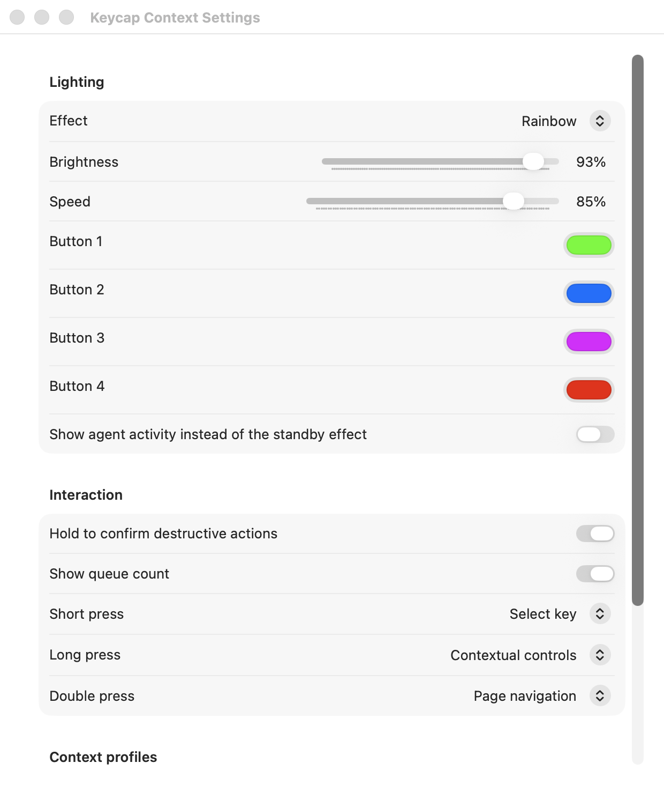

# Keycap Context

Keycap Context is an open-source, local-first four-key controller for AI coding
agents. It turns Claude Code, Codex, Gemini CLI, Antigravity, OpenCode, and
generic agent prompts into a native macOS overlay you can answer from physical
keys.



## What it includes

- Zephyr firmware for a XIAO nRF54L15 Sense and Adafruit NeoKey 1x4
- Native macOS menu-bar host, choice overlay, lighting settings, and agent console
- Adapters for Claude Code, Codex, Gemini CLI, Antigravity, OpenCode, and generic JSON
- Short, long, and double-press gestures with RGB status and standby effects
- Four audio-reactive standby effects driven by the board's own microphone

## Quick start

```sh
./scripts/install.sh
```

For development without hardware:

```sh
cd host/macos
swift test
swift run keycap-host --demo
```

Firmware build:

```sh
west build -b xiao_nrf54l15/nrf54l15/cpuapp firmware
west flash
```

See [firmware setup](firmware/README.md), [architecture](docs/architecture.md),
and [adapter API](docs/http-api.md) for details.

## Hardware

Connect NeoKey `VIN/GND/SDA/SCL` to XIAO `3V3/GND/D4/D5`. Do not power NeoKey
VIN from both 3V3 and 5V.

## Privacy

The host is local-only and needs no macOS Accessibility permission. Adapters
reach it over loopback and authenticate with a per-install token.

The optional audio-reactive effects use the keypad's own microphone. Sound is
turned into four band levels on the device and drives its LEDs directly: no
audio and no derived measurement crosses the USB link, and the microphone is
left unpowered whenever another effect is selected. See [SECURITY.md](SECURITY.md).

## License

Apache-2.0
